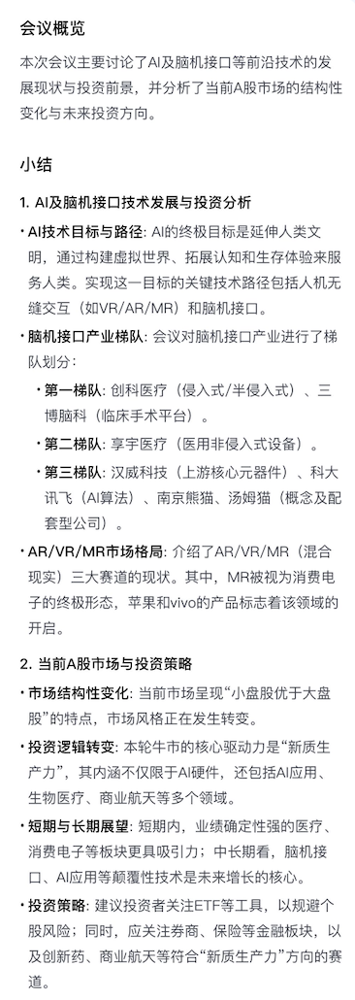

# AchesonD77 写在最前面
- 如果你想要看每周的最新的更新和思考，请：[Weekly_Meetings_Notes](Weekly_Meetings_Notes/)，
  - 其中**按月份**进行分类（一个月中**有四次会议**）。
  - 每个会议具有**一份快速纪要（图片精简总结）**和**原稿记录PDF（包括勾画**），**一份自我思考md文件**
- - 目前最新更新日期为：会议日期为：**2026年07月01日**。 内容更新为：2026年7月8日。（最新一期本周的还未来得及更新）
  - 快速纪要：
  - 详细记录：[7月第一周(0701-0708)_A股大盘市场变化预测，AI以及脑机接口、创新药、ETF、新质生产力和证券板块](Weekly_Meetings_Notes/2026年7月/2607_01_7月第一周(0701-0708)_A股大盘市场变化预测，AI以及脑机接口、创新药、ETF、新质生产力和证券板块.pdf)
  - 自我思考：[7月](Weekly_Meetings_Notes/2026年7月/2607_01_7月.md)

# 📈 Financial Market Notes｜金融市场热点和读书反思笔记
 
> 一个用于记录每周市场热点、行业观察、主题跟踪与金融阅读笔记的个人知识仓库。  
> 保持 每周 持续记录，持续复盘，持续沉淀对市场与投资的长期理解。

---

## ✨ 仓库简介

这个仓库主要用于整理本人日常学习和观察中的金融市场笔记，内容涵盖：

- 每周市场热点讨论与复盘 
- 宏观、政策与国际事件跟踪
- 行业与主题投资观察
- 金融、投资、商业相关书籍阅读笔记
- 对市场逻辑、周期变化与长期认知的个人思考

我希望通过这个仓库，把零散的信息和阶段性的想法逐步整理成一个可回顾、可复盘、可持续更新的知识体系。

---

## 📂 仓库结构

    FinancialNotes/
    ├── README.md
    ├── LICENSE
    ├── Weekly_Meetings_Notes/
    └── Book_Notes/

---

## 🗂️ 内容说明 - 快速指南 

### [1. Weekly_Meetings_Notes](Weekly_Meetings_Notes/)

该部分主要用于记录每周市场讨论与热点跟踪。

内容通常包括：

- 市场热点总结
- 宏观环境与政策变化
- 国际事件对市场的影响
- 行业轮动与主题投资机会观察
- 对市场节奏、资金风格和风险偏好的理解
- 阶段性市场复盘与个人思考

这一部分更偏向于**对当下市场的持续跟踪与动态记录**。

---

### [2. Book_Notes](Book_Notes)

该部分主要用于整理金融、投资、商业相关书籍或优质内容的阅读笔记，内容通常包括：
倾向于格雷厄姆、巴菲特、芒格、段永平的投资想法和风格。

- 经典投资书籍笔记, 目前已更新：
  - [段永平精华合集](Book_Notes/1_段永平精华合集) 中：
[1_1《雪球特别版——段永平投资问答录（投资逻辑篇）》](Book_Notes/1_段永平精华合集/1_雪球特别版_段永平投资问答录（投资逻辑篇）_金融读书笔记.pdf)
[1_2《段永平投资实战》](Book_Notes/1_段永平精华合集/2_段永平投资实战_金融读书笔记.pdf) 
  - [富爸爸与穷爸爸系列](Book_Notes/2_富爸爸穷爸爸)
- 优质观点与访谈整理
- 投资框架与思维方式总结
- 长期认知相关内容的摘录与思考

这一部分更偏向于**长期知识积累与认知沉淀**。

---

## 🎯 仓库目的

建立这个仓库，主要是为了：

- 记录市场中的重要变化与核心逻辑
- 区分短期市场跟踪与长期阅读积累
- 提升自己对行业、市场和投资框架的理解
- 形成一个可以长期更新和反复复盘的个人知识仓库

---

## 🔍 使用方式

你可以按照以下方式浏览本仓库：

- 想看每周市场热点和讨论内容，可进入 `Weekly_Meetings_Notes`
- 想看金融书籍笔记和长期思考，可进入 `Book_Notes`
- 可根据文件标题快速定位具体主题
- 可结合不同时间段的笔记，观察市场主线和个人理解的变化

---

## 📝 记录说明

本仓库中的内容主要用于个人学习、记录与思考，具有以下特点：

- 以个人研究和阶段性理解为主
- 强调持续积累，而非一次性结论
- 部分内容可能带有时间背景和市场环境特征
- 后续会根据新的认知和市场变化持续补充与更新

---

## ⚠️ 免责声明

本仓库内容仅用于个人学习、记录与思考，不构成任何投资建议、买卖建议或收益承诺。  
市场有风险，投资需谨慎，请独立判断并自行承担相关决策责任。

---

## 📌 后续计划

后续我会逐步补充和完善以下内容：

- 按时间整理每周市场笔记
- 按主题整理行业与热点跟踪
- 按书籍或作者分类整理阅读笔记
- 优化仓库结构，提升检索与回顾效率

---

## 📄 License

本仓库的许可协议请见 `LICENSE` 文件。
